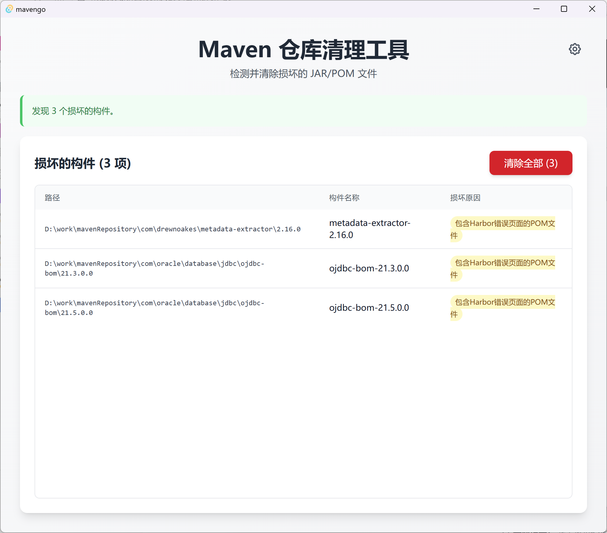

# MavenGo

一个基于 **Tauri v2 + Vue 3 + Rust** 的 Maven 本地仓库清理工具，用于检测和清理损坏的 JAR/POM 文件。



## ✨ 核心功能

- 🔍 **智能检测**：自动扫描 Maven 本地仓库中的损坏文件
  - 通过 ZIP 格式验证检测损坏的 JAR 文件（支持 deflate、bzip2、zstd 压缩算法）
  - 包含 Harbor 错误页面的 POM 文件（`<!DOCTYPE html>`, `<title>Harbor</title>` 等关键词）
- ⚡ **多线程扫描**：利用 Rust Rayon 并行处理，线程数自动调整为 `CPU核心数 × 4`
- 🧹 **批量清理**：一键删除检测到的无效构建产物
- 🎯 **自动定位**：智能检测 Maven 仓库路径（支持 `mvn -v`、环境变量、`~/.m2/settings.xml`）

## 🚀 快速开始

### 环境要求

- **Node.js** 18+（推荐使用 pnpm）
- **Rust** 1.70+（Tauri v2 要求）
- **Maven**（可选，用于自动检测仓库路径）

### 安装依赖

```bash
pnpm install
```

### 开发模式

```bash
# 启动开发服务器（自动启动 Vite + Tauri）
pnpm tauri dev
```

### 构建应用

```bash
# 前端类型检查 + 构建
pnpm build

# 构建桌面应用程序（生成安装包）
pnpm tauri build
```

## 🏗️ 技术架构

### 技术栈

- **前端**：Vue 3 (Composition API) + TypeScript + Vite + Tailwind CSS
- **后端**：Rust + Tauri v2
- **包管理**：pnpm
- **并发处理**：Rayon（Rust 并行迭代器）

### 核心 Rust Commands

| Command | 功能 | 返回类型 |
|---------|------|----------|
| `get_maven_repo_path` | 自动检测 Maven 仓库路径 | `Result<String, String>` |
| `scan_invalid_artifacts` | 扫描损坏的 JAR/POM 文件 | `Result<Vec<InvalidArtifact>, String>` |
| `clean_artifacts` | 批量删除指定的无效文件 | `Result<CleanResult, String>` |

### 检测规则

#### 损坏的 JAR 文件
- **ZIP 格式验证**：尝试作为 ZIP 归档打开，失败则标记为损坏
- **支持的压缩算法**：deflate（标准）、bzip2、zstd
- **检测原理**：JAR 本质是 ZIP 文件，通过 `zip` crate 验证文件完整性
- **常见原因**：网络中断、下载失败、磁盘损坏、非标准压缩方法

#### 损坏的 POM 文件
- 包含 HTML 错误页面关键词：
  - `<!DOCTYPE html>`
  - `<title>Harbor</title>`
  - `Login to Harbor`
- 通常由私服（如 Harbor）返回错误页面导致

## 📁 项目结构

```
mavengo/
├── src/                     # Vue 前端源码
│   ├── components/         # Vue 组件
│   ├── App.vue            # 主应用组件
│   └── main.ts            # 应用入口
├── src-tauri/              # Rust 后端源码
│   ├── src/
│   │   ├── lib.rs         # Tauri Commands 实现
│   │   └── main.rs        # 应用入口
│   ├── capabilities/      # Tauri v2 权限配置
│   ├── Cargo.toml         # Rust 依赖
│   └── tauri.conf.json    # Tauri 配置
├── clean.py               # 独立的 Python 清理脚本（遗留）
├── package.json           # 前端依赖
└── vite.config.ts         # Vite 配置
```

## 🛠️ 开发指南

### 前后端通信

前端通过 `@tauri-apps/api/core` 的 `invoke` 调用 Rust Command：

```typescript
// 前端调用示例
import { invoke } from '@tauri-apps/api/core';

const repoPath = await invoke<string>('get_maven_repo_path');
const invalidFiles = await invoke<InvalidArtifact[]>('scan_invalid_artifacts', { 
  repoPath 
});
```

```rust
// Rust Command 定义
#[tauri::command]
fn get_maven_repo_path() -> Result<String, String> {
    // 实现逻辑...
}
```

### Tauri 权限配置

项目使用 Tauri v2 Capabilities 权限模型，配置文件位于 `src-tauri/capabilities/default.json`。

当前已启用权限：
- `core:default`：核心 API
- `fs:default`：文件系统访问
- `opener:default`：打开外部链接

### 性能优化

- **多线程扫描**：使用 Rayon 并行处理文件检查，线程池大小自动调整为 `CPU核心数 × 4`
- **增量扫描**：跳过隐藏目录（`.` 开头），仅处理 `.jar` 和 `.pom` 文件
- **内存安全**：所有错误处理使用 `Result<T, E>` 类型，避免 Panic

## 💻 IDE 推荐

- [VS Code](https://code.visualstudio.com/)
- 推荐插件：
  - [Vue - Official](https://marketplace.visualstudio.com/items?itemName=Vue.volar)
  - [Tauri](https://marketplace.visualstudio.com/items?itemName=tauri-apps.tauri-vscode)
  - [rust-analyzer](https://marketplace.visualstudio.com/items?itemName=rust-lang.rust-analyzer)
  - [Tailwind CSS IntelliSense](https://marketplace.visualstudio.com/items?itemName=bradlc.vscode-tailwindcss)

## 📝 注意事项

### Rust 端
- 禁止使用 `.unwrap()` 和 `.expect()`，必须使用 `Result<T, E>` 处理错误
- 耗时操作使用 `async` 或 `tauri::async_runtime::spawn` 避免阻塞主线程

### 前端端
- 所有 `invoke` 调用必须处理 Promise rejection
- 修改 Rust 代码需重启 Tauri（Vite HMR 不监听 `src-tauri/` 目录）

### Windows 兼容性
- Cargo.toml 中 `lib.name = "mavengo_lib"` 避免库名与二进制名冲突（[rust-lang/cargo#8519](https://github.com/rust-lang/cargo/issues/8519)）

## 📄 许可证

MIT License

---

**开发中遇到问题？** 查看 [CLAUDE.md](./CLAUDE.md) 了解项目架构细节。
